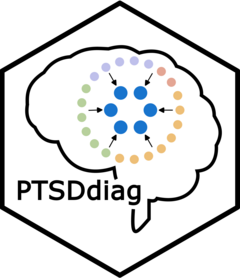

<!-- README.md is generated from README.Rmd. Please edit that file -->

```{r, include = FALSE}
knitr::opts_chunk$set(
  collapse = TRUE,
  comment = "#>",
  fig.path = "man/figures/README-",
  out.width = "100%"
)
```



# PTSDdiag

<!-- badges: start -->
<!-- badges: end -->

## Description 
PTSDdiag is a comprehensive R package for analyzing and simplifying PTSD diagnostic criteria using PCL-5 (PTSD Checklist for DSM-5) data. It provides tools to identify optimal subsets of six PCL-5 items that maintain diagnostic accuracy while reducing assessment burden. 

## **Key Features**

 * Data preparation and standardization for PCL-5 scores
 * Implementation of DSM-5 diagnostic criteria
 * Calculation of diagnostic metrics and summary statistics
 * Simplification of diagnostic criteria through:
    * Hierarchical (cluster-based) approach
    * Non-hierarchical approach
 * Comparison of different diagnostic approaches
 * Model validation using:
    * Holdout Validation
    * Cross-Validation

## Installation

This package is currently only hosted on GitHub. It can be installed using the usual way:
``` {r, eval = FALSE}
install.packages("devtools")
devtools::install_github("WeidmannL/PTSDdiag")
```

## Getting Started

The vignette demonstrates how to use the package to prepare the PCL-5 data, calculate some basic descriptive statistics and reliability metrics, find the optimal minimal symptom combinations for PTSD diagnosis, compare different diagnostic approaches and perform validation methods for evaluating model performance.

 * [An Introduction to PTSDdiag](https://osf.io/64n5c/files/ycavz)
 
## Bugs, Contributions

* If you have any suggestions or if you find a bug, please report them using GitHub [issue tracker](https:://github.com/WeidmannL/PTSDdiag/issues).
* Contributions are welcome! Please feel free to submit a Pull Request.
